# Dimensionality Reduction of US Census Data using Principal Component Analysis (PCA)


## Table Of Contents


- [Introduction](#introduction)
- [Setup Instructions](#setup-instructions)
  * [Log in to the AWS console and create a notebook instance](#log-in-to-the-aws-console-and-create-a-notebook-instance)
  * [Use git to clone the repository into the notebook instance](#use-git-to-clone-the-repository-into-the-notebook-instance)
- [Machine Learning Pipeline](#machine-learning-pipeline)
  * [Step 1 - Loading data from S3](#step-1---loading-data-from-s3)
  * [Step 2 - Exploratory Data Analysis (EDA)](#step-2---exploratory-data-analysis--eda-)
    + [Part A - Visualizing data](#part-a---visualizing-data)
    + [Part B - Data Modeling](#part-b---data-modeling)
  * [Step 2 - Dimensionality Reduction](#step-2---dimensionality-reduction)
    + [Part A - Define a PCA model](#part-a---define-a-pca-model)
    + [Part B - Train the model](#part-b---train-the-model)
  * [Step 3 - Data variance](#step-3---data-variance)
    + [Part A - Tradeoff - dimensionality vs data variance](#part-a---tradeoff---dimensionality-vs-data-variance)
    + [Part B - Component makeup](#part-b---component-makeup)
  * [Step 5 - Deploying the PCA model](#step-5---deploying-the-pca-model)
  * [Step 6 - Population segmentation](#step-6---population-segmentation)
    + [Part A - Exploring the resultant clusters](#part-a---exploring-the-resultant-clusters)
    + [Part B - Visualizing data distribution across clusters](#part-b---visualizing-data-distribution-across-clusters)
  * [Step 7 - Model attributes and explainability](#step-7---model-attributes-and-explainability)
    + [Part A - Visualizing centroids in component space](#part-a---visualizing-centroids-in-component-space)
    + [Part B - Natural Groupings](#part-b---natural-groupings)
  * [Important - Deleting the endpoint](#important---deleting-the-endpoint)


## Introduction


In this project, two unsupervised learning algorithms were used to perform population segmentation. The goal was to find natural groupings in population data that might reveal some feature-level similarities between different regions in the US.


First, [Principal Component Analysis (PCA)](https://en.wikipedia.org/wiki/Principal_component_analysis) was used to reduce the dimensionality of US Census Data while still preserving 80% of the original data variance. Then, a [K-means Clustering](https://en.wikipedia.org/wiki/K-means_clustering) model was trained to assign US counties to individual clusters dependent upon their location within component space. Each cluster represents which traits and demographic characteristics are similar across the counties within that grouping. This information can be used to develop effective marketing campaigns for targeted demographics across different geographic areas. The clusterings may also reveal certain patterns that were not easily noticeable before.


The data used in this project was collected as part of the [US Census](https://en.wikipedia.org/wiki/United_States_Census), which not only provides population metrics from counties across the United States but also includes demographic traits such as race, employment, and transportation means. Everything for this project was done on Amazon Web Services (AWS) and their SageMaker platform as the goal of this project was to further familiarize myself with the AWS ecosystem.


## Setup Instructions


The notebook in this repository is intended to be executed using Amazon's SageMaker platform and the following is a brief set of instructions on setting up a managed notebook instance using SageMaker.


### Log in to the AWS console and create a notebook instance


Log in to the AWS console and go to the SageMaker dashboard. Click on 'Create notebook instance'. The notebook name can be anything and using ml.t2.medium is a good idea as it is covered under the free tier. For the role, creating a new role works fine. Using the default options is also okay. Important to note that you need the notebook instance to have access to S3 resources, which it does by default. In particular, any S3 bucket or object with 'sagemaker' in the name is available to the notebook.


### Use git to clone the repository into the notebook instance


Once the instance has been started and is accessible, click on 'Open Jupyter' to get to the Jupyter notebook main page. To start, clone this repository into the notebook instance.


Click on the 'new' dropdown menu and select 'terminal'. By default, the working directory of the terminal instance is the home directory, however, the Jupyter notebook hub's root directory is under 'SageMaker'. Enter the appropriate directory and clone the repository as follows.


```
cd SageMaker
git clone https://github.com/Supearnesh/ml-census-pca.git
exit
```


After you have finished, close the terminal window.


## Machine Learning Pipeline


This was the general outline followed for this SageMaker project:


1. Loading data from S3
2. Exploratory Data Analysis (EDA)
    * a. Visualizing data
    * b. Data modeling
3. Dimensionality reduction
    * a. Define a PCA model
    * b. Train the model
4. Data variance
    * a. Tradeoff - dimensionality vs data variance
    * b. Component makeup
5. Deploying the PCA model
6. Population segmentation
    * a. Exploring the resultant clusters
    * b. Visualizing data distribution across clusters
7. Model attributes and explainability
    * a. Visualizing centroids in component space
    * b. Natural groupings
8. Important: Deleting the endpoint


### Step 1 - Loading data from S3


This particular dataset is already in an Amazon S3 bucket so the data can be easily loaded and retrieved with a call to `client.get_object()`.


> S3 interactions can be executed using a `boto3` client.


```python
# boto3 client to get S3 data
s3_client = boto3.client('s3')
bucket_name = 'aws-ml-blog-sagemaker-census-segmentation'

# get a list of objects in the bucket
obj_list = s3_client.list_objects(Bucket=bucket_name)

# get an S3 object by passing in the bucket and file name
data_object = s3_client.get_object(Bucket=bucket_name, Key=file_name)

# what info does the object contain?
display(data_object)
```


The 'data_object' variable is of `bytes` datatype, which can read be read in using [io.BytesIO(file)](https://docs.python.org/3/library/io.html#binary-i-o).


### Step 2 - Exploratory Data Analysis (EDA)


Now that the data has been loaded in, it can be cleaned, explored, and pre-processed. Data exploration is an important part of the machine learning pipeline because it brings to light any initial patterns in data distribution and features that may be informative in giving direction on how to proceed with modeling and clustering the data.


To begin the data cleansing phase, the first task will be to remove any rows that contain missing features. This can be done fairly easily; it may also be useful to do a quick row count before and after the data cleansing step to see how many data points were removed, if any.


```python
# print out stats about data
# rows = data, cols = features
print('(orig) rows, cols: ', counties_df.shape)

# drop any incomplete rows of data, and create a new df
clean_counties_df = counties_df.dropna(axis=0)
print('(clean) rows, cols: ', clean_counties_df.shape)
```


    (orig) rows, cols:  (3220, 37)
    (clean) rows, cols:  (3218, 37)


In order to proceed with clustering this data, another data cleansing step needs to be completed; machine learning models require numerical data for training, so it makes sense to index this data by region by combining the 'State' and 'County' values and dropping the individual columns, along with 'CensusId', as these do not provide any meaningful demographic information.


```python
# index data by 'State-County'
clean_counties_df.index=clean_counties_df['State'] + "-" + clean_counties_df['County']
clean_counties_df.head()

# drop the old State and County columns, and the CensusId column
# clean df should be modified or created anew
drop = ['CensusId', 'State', 'County']
clean_counties_df = clean_counties_df.drop(columns=drop)
clean_counties_df.head()
```


After these data cleansing steps, the end result is one resulting DataFrame with an index of 'State-County' and 34 different columns representing features of numerical data for each county.


```
                TotalPop     Men      Women    Hispanic    ...
                
Alabama-Autauga    55221     26745    28476    2.6         ...
Alabama-Baldwin    195121    95314    99807    4.5         ...
Alabama-Barbour    26932     14497    12435    4.6         ...
...

```


The 34 features that are present in the dataset are listed below.


```python
# features
features_list = clean_counties_df.columns.values
print('Features: \n', features_list)
```

    Features: 
     ['TotalPop' 'Men' 'Women' 'Hispanic' 'White' 'Black' 'Native' 'Asian'
     'Pacific' 'Citizen' 'Income' 'IncomeErr' 'IncomePerCap' 'IncomePerCapErr'
     'Poverty' 'ChildPoverty' 'Professional' 'Service' 'Office' 'Construction'
     'Production' 'Drive' 'Carpool' 'Transit' 'Walk' 'OtherTransp'
     'WorkAtHome' 'MeanCommute' 'Employed' 'PrivateWork' 'PublicWork'
     'SelfEmployed' 'FamilyWork' 'Unemployment']


#### Part A - Visualizing data


The data values across these columns are mostly percentages ranging between 0 to 100 or counts with integer values. The data can be visualized to understand the distribution across all counties better.


The cell below contains [histograms](https://en.wikipedia.org/wiki/Histogram) which show the distribution of data points over discrete feature ranges. The x-axis represents the different bins; each bin is defined by a specific range of values that a feature can take i.e. between the values of 0-5, 5-10, 10-15, etc. The y-axis is the frequency of occurrence or the number of county data points that fall into each bin. It is helpful to use the y-axis values for relative comparisons between different features.


Below, a histogram comparing the methods of commuting to work is plotted over all counties. The feature names are copied from the list of column names. These features are represented as percentages in the original data, so the x-axes of these plots will be comparable.


```python
# transportation (to work)
transport_list = ['Drive', 'Carpool', 'Transit', 'Walk', 'OtherTransp']
n_bins = 75 # can decrease to get a wider bin (or vice versa)

for column_name in transport_list:
    ax=plt.subplots(figsize=(6,3))
    # get data by column_name and display a histogram
    ax = plt.hist(clean_counties_df[column_name], bins=n_bins)
    title="Histogram of " + column_name
    plt.title(title, fontsize=12)
    plt.show()
```


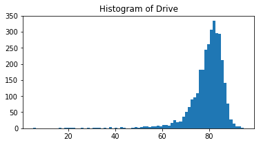


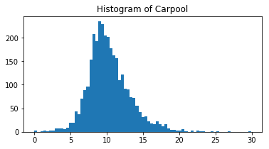


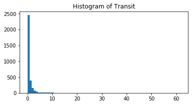


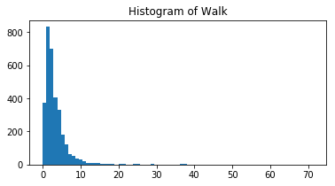


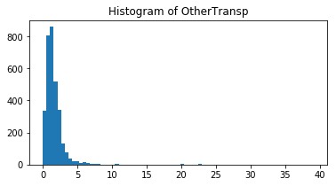


Below, another histogram comparing employment is plotted for all counties. The buckets are split between private sector, public sector, self-employment, family-employment, and unemployment.


```python
# employment metrics
my_list = ['PrivateWork', 'PublicWork', 'SelfEmployed', 'FamilyWork', 'Unemployment']
n_bins = 50 # define n_bins

# histogram creation code is similar to above
for column_name in my_list:
    ax=plt.subplots(figsize=(6,3))
    # get data by column_name and display a histogram
    ax = plt.hist(clean_counties_df[column_name], bins=n_bins)
    title="Histogram of " + column_name
    plt.title(title, fontsize=12)
    plt.show()
```


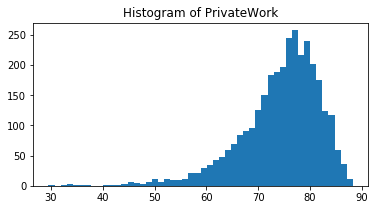


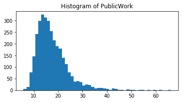


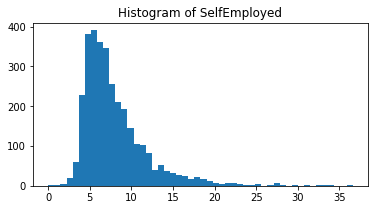


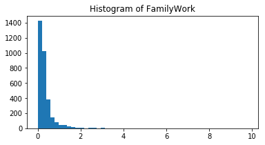


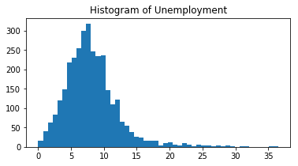


In order to standardize the scale of numerical columns to better compare the values of different features, a [MinMaxScaler](https://scikit-learn.org/stable/modules/generated/sklearn.preprocessing.MinMaxScaler.html) can be used to transform the numerical values so they all fall between 0 and 1.


```python
# scale numerical features into a normalized range, 0-1
from sklearn.preprocessing import MinMaxScaler
scaler = MinMaxScaler()

# store them in this dataframe
counties_scaled = pd.DataFrame(scaler.fit_transform(clean_counties_df.astype(float)))
```


#### Part B - Data Modeling


Now that the data has been cleaned and standardized, it is ready to be fed into a machine learning model. Each data point has 34 features, which means the data is 34-dimensional. Clustering algorithms rely on finding clusters in n-dimensional feature space. For higher dimensions, an algorithm like k-means has a difficult time figuring out which features are most important, and the result is, often, noisier clusters.


Some dimensions are not as important as others. For example, if every county in our dataset has the same rate of unemployment, then that particular feature doesn’t provide any distinguishing information; it will not help to separate counties into different groups because its value doesn’t *vary* between counties.


> Instead, it would be useful to identify the features that help to separate and group data. The goal is to find features that cause the **most variance** in the dataset.


Before this data is clustered, it will be helpful to take a dimensionality reduction step. The aim will be to form a smaller set of features that will better separate the data. The technique used is called [Principal Component Analysis (PCA)](https://en.wikipedia.org/wiki/Principal_component_analysis).


### Step 2 - Dimensionality Reduction


PCA attempts to reduce the number of features within a dataset while retaining the “principal components”, which are defined as *weighted*, linear combinations of existing features that are designed to be linearly independent and account for the largest possible variability in the data. This method can be thought of as taking many features and combining similar or redundant features together to form a new, smaller feature set.


For this dimensionality reduction exercise, the built-in SageMaker model for PCA can be leveraged.


Roles and Buckets


> To create a model, an IAM role needs to be specified first, and to save the model attributes, they will need to be stored in an S3 bucket.


The `get_execution_role` function retrieves the IAM role created at the time the notebook instance was created. Roles are essentially used to manage permissions and [this documentation](https://docs.aws.amazon.com/sagemaker/latest/dg/sagemaker-roles.html) covers that more in depth. This work was done in a notebook with a FullAccess role, which grants permission to access and download the census data stored in S3.


A bucket name must be specified for the S3 bucket to store the SageMaker model parameters. The bucket must be in the same region as the notebook being used to access it. The default S3 bucket creation method can be leveraged to automatically create a bucket in the same region as the notebook by storing the current SageMaker session and calling `session.default_bucket()`.


```python
from sagemaker import get_execution_role

session = sagemaker.Session() # store the current SageMaker session

# get IAM role
role = get_execution_role()
print(role)
```

    arn:aws:iam::578203129999:role/service-role/AmazonSageMaker-ExecutionRole-20200419T032205


```python
# get default bucket
bucket_name = session.default_bucket()
print(bucket_name)
print()
```


    sagemaker-us-east-1-578203129999


#### Part A - Define a PCA model


To create a PCA model, the built-in SageMaker resource can be used. A SageMaker estimator requires a number of parameters to be specified; these define the type of training instance to use and the model hyperparameters. A PCA model requires the following constructor arguments:


* role - the IAM role, which was specified above
* train_instance_count - the number of training instances (typically 1)
* train_instance_type - the type of SageMaker instance for training
* num_components - an integer that defines the number of PCA components to produce
* sagemaker_session - the session used to train on SageMaker


Documentation on the PCA model can be found [here](http://sagemaker.readthedocs.io/en/latest/pca.html).


Below, the `output_path` is specified to save the model training data.


```python
# define location to store model artifacts
prefix = 'counties'

output_path='s3://{}/{}/'.format(bucket_name, prefix)

print('Training artifacts will be uploaded to: {}'.format(output_path))
```

    Training artifacts will be uploaded to: s3://sagemaker-us-east-1-578203129999/counties/


```python
# define a PCA model
from sagemaker import PCA

# this is current features - 1
# you'll select only a portion of these to use, later
N_COMPONENTS=33

pca_SM = PCA(role=role,
             train_instance_count=1,
             train_instance_type='ml.c4.xlarge',
             output_path=output_path, # specified, above
             num_components=N_COMPONENTS, 
             sagemaker_session=session)
```


The *record_set* function in the SageMaker PCA model can convert numpy arrays into the **RecordSet** format that is required for training input data. This is a requirement for _all_ of SageMaker's built-in models. The use of this data type is one of the reasons that allows training of models within Amazon SageMaker to perform faster, especially for large datasets.


```python
# convert df to np array
train_data_np = counties_scaled.values.astype('float32')

# convert to RecordSet format
formatted_train_data = pca_SM.record_set(train_data_np)
```


#### Part B - Train the model


The fit function is then called on the PCA model to pass in the formatted training data. This spins up a training instance to perform the training job.


Fitting the data happens quite quickly, rather it is launching the specified training instance which takes up a bulk of the time for this operation.


```python
%%time

# train the PCA mode on the formatted data
pca_SM.fit(formatted_train_data)
```


After the model is training, the underlying model parameters can be accessed. Once the training job is complete, the job can be found under **Jobs** in the **Training** subsection in the Amazon SageMaker console. The job name will be listed amongst the training jobs. That job name will be used in the following code to specify which model to examine.


Model artifacts are stored in S3 as a TAR file, a compressed file within the output path specified previously as 'output/model.tar.gz'. The artifacts stored here can be used to deploy a trained model.


```python
# Get the name of the training job, it's suggested that you copy-paste
# from the notebook or from a specific job in the AWS console

training_job_name='pca-2020-04-30-00-02-39-867'

# where the model is saved, by default
model_key = os.path.join(prefix, training_job_name, 'output/model.tar.gz')
print(model_key)

# download and unzip model
boto3.resource('s3').Bucket(bucket_name).download_file(model_key, 'model.tar.gz')

# unzipping as model_algo-1
os.system('tar -zxvf model.tar.gz')
os.system('unzip model_algo-1')
```


Many of the Amazon SageMaker algorithms use [MXNet](https://aws.amazon.com/mxnet) for computational speed, including PCA, and so the model artifacts are stored as an array. After the model is unzipped and decompressed, the array can be loaded using MXNet.


```python
import mxnet as mx

# loading the unzipped artifacts
pca_model_params = mx.ndarray.load('model_algo-1')

# what are the params
print(pca_model_params)
```

    {'s': 
    [1.7896362e-02 3.0864021e-02 3.2130770e-02 3.5486195e-02 9.4831578e-02
     1.2699370e-01 4.0288666e-01 1.4084760e+00 1.5100485e+00 1.5957943e+00
     1.7783760e+00 2.1662524e+00 2.2966361e+00 2.3856051e+00 2.6954880e+00
     2.8067985e+00 3.0175958e+00 3.3952675e+00 3.5731301e+00 3.6966958e+00
     4.1890211e+00 4.3457499e+00 4.5410376e+00 5.0189657e+00 5.5786467e+00
     5.9809699e+00 6.3925138e+00 7.6952214e+00 7.9913125e+00 1.0180052e+01
     1.1718245e+01 1.3035975e+01 1.9592180e+01]
    <NDArray 33 @cpu(0)>, 'v': 
    [[ 2.46869749e-03  2.56468095e-02  2.50773830e-03 ... -7.63925165e-02
       1.59879066e-02  5.04589686e-03]
     [-2.80601848e-02 -6.86634064e-01 -1.96283013e-02 ... -7.59587288e-02
       1.57304872e-02  4.95312130e-03]
     [ 3.25766727e-02  7.17300594e-01  2.40726061e-02 ... -7.68136829e-02
       1.62378680e-02  5.13597298e-03]
     ...
     [ 1.12151138e-01 -1.17030945e-02 -2.88011521e-01 ...  1.39890045e-01
      -3.09406728e-01 -6.34506866e-02]
     [ 2.99992133e-02 -3.13433539e-03 -7.63589665e-02 ...  4.17341813e-02
      -7.06735924e-02 -1.42857227e-02]
     [ 7.33537527e-05  3.01008171e-04 -8.00925500e-06 ...  6.97060227e-02
       1.20169498e-01  2.33626723e-01]]
    <NDArray 34x33 @cpu(0)>, 'mean': 
    [[0.00988273 0.00986636 0.00989863 0.11017046 0.7560245  0.10094159
      0.0186819  0.02940491 0.0064698  0.01154038 0.31539047 0.1222766
      0.3030056  0.08220861 0.256217   0.2964254  0.28914267 0.40191284
      0.57868284 0.2854676  0.28294644 0.82774544 0.34378946 0.01576072
      0.04649627 0.04115358 0.12442778 0.47014    0.00980645 0.7608103
      0.19442631 0.21674445 0.0294168  0.22177474]]
    <NDArray 1x34 @cpu(0)>}


Three types of model attributes are contained within the PCA model:


* **mean** - the mean that was subtracted from a component in order to center it
* **v** - the makeup of the principal components; (same as ‘components_’ in an sklearn PCA model)
* **s** - the singular values of the components for the PCA transformation, this does not exactly give the % variance from the original feature space but can give the % variance from the projected feature space


Here, the attributes of interest are **v** and **s**.


From **s**, an approximation of the data variance that is covered in the first `n` principal components can be derived. The approximate explained variance is given by the formula: the sum of squared **s** values for all top n components over the sum over squared **s** values for _all_ components:
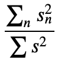


From **v**, more can be learned about the combinations of original features that make up each principal component.


```python
# get selected params
s=pd.DataFrame(pca_model_params['s'].asnumpy())
v=pd.DataFrame(pca_model_params['v'].asnumpy())
```


### Step 3 - Data variance


The current PCA model creates 33 principal components, but when new dimensionality-reduced training data is created, only a few, top n components will be selected to use. To decide how many top components to include, it's helpful to look at how much **data variance** the components capture. For the original, high-dimensional data, 34 features captured 100% of the data variance. If some of these higher dimensions are discarded, the amount of captured variance will be lowered.


#### Part A - Tradeoff - dimensionality vs data variance


As an illustrative example, say the original data is in three dimensions. So, three dimensions capture 100% of the data variance; these dimensions cover the entire spread of the data. The below images are taken from the PhD thesis, [“Approaches to analyse and interpret biological profile data”](https://publishup.uni-potsdam.de/opus4-ubp/frontdoor/index/index/docId/696) by Matthias Scholz, (2006, University of Potsdam, Germany).


Now, it may be noted that most of this data seems related; it falls close to a 2D plane, and just by looking at the spread of the data, the correlation between the original, three dimensions can be visualized. So, instead, the same data can be represented in two new dimensions, made up of linear combinations of the original, three dimensions. These dimensions are represented by the two axes/lines, centered in the data. 


If this is projected in a new, 2D space, it can be seen that most of the original data variance is still captured using *just* two dimensions. There is a tradeoff between the amount of variance that can be captured and the number of component-dimensions used to represent the data.


When the top n components to use in a new data model are selected, enough components should be included in order to capture about 80-90% of the original data variance. This project is looking at generalizing over a lot of data so the aim can be set for about 80% coverage.


**Note**: The _top_ principal components, with the largest **s** values, are actually at the end of the **s** DataFrame. Below, the **s** values for the top n, principal components are printed.


```python
# looking at top 5 components
n_principal_components = 5

start_idx = N_COMPONENTS - n_principal_components  # 33-n

# print a selection of s
print(s.iloc[start_idx:, :])
```


                0
    28   7.991313
    29  10.180052
    30  11.718245
    31  13.035975
    32  19.592180


In creating new training data, the top n principal components that account for at least 80% data variance should be chosen.


The function, `explained_variance`, takes in the entire array `s` and a number of top principal components to consider, then returns the approximate, explained variance for those top n components.


To calculate the explained variance for the top 5 components, **s** squared for *each* of the top 5 components is calculated, added up, and normalized by the sum of *all* squared **s** values, according to this formula:


> This function can be used to answer the **question**: What is the smallest number of principal components that captures at least 80% of the total variance in the dataset?


```python
# Calculate the explained variance for the top n principal components
# you may assume you have access to the global var N_COMPONENTS
def explained_variance(s, n_top_components):
    '''Calculates the approx. data variance that n_top_components captures.
       :param s: A dataframe of singular values for top components; 
           the top value is in the last row.
       :param n_top_components: An integer, the number of top components to use.
       :return: The expected data variance covered by the n_top_components.'''
    
    start_idx = N_COMPONENTS - n_top_components  # 33-n
    
    # calculate approximate variance
    exp_variance = np.square(s.iloc[start_idx:,:]).sum() / np.square(s).sum()
    return exp_variance[0]
```


For the top 7 components, the explained variance is calculated to be roughly 80% below.


```python
# test cell
n_top_components = 7 # select a value for the number of top components

# calculate the explained variance
exp_variance = explained_variance(s, n_top_components)
print('Explained variance: ', exp_variance)
```


    Explained variance:  0.80167246


The top principal component accounts for about 32% of the data variance. Next, it may be worth asking what makes up this (and other components) and what linear combination of features make these components so influential in describing the spread of the data.


The original features are listed below, for reference.


```python
# features
features_list = counties_scaled.columns.values
print('Features: \n', features_list)
```

    Features: 
     ['TotalPop' 'Men' 'Women' 'Hispanic' 'White' 'Black' 'Native' 'Asian'
     'Pacific' 'Citizen' 'Income' 'IncomeErr' 'IncomePerCap' 'IncomePerCapErr'
     'Poverty' 'ChildPoverty' 'Professional' 'Service' 'Office' 'Construction'
     'Production' 'Drive' 'Carpool' 'Transit' 'Walk' 'OtherTransp'
     'WorkAtHome' 'MeanCommute' 'Employed' 'PrivateWork' 'PublicWork'
     'SelfEmployed' 'FamilyWork' 'Unemployment']


#### Part B - Component makeup


Now, the makeup of each PCA component can be examined based on **the weightings of the original features that are included in the component**. The following code shows the feature-level makeup of the first component.


```python
import seaborn as sns

def display_component(v, features_list, component_num, n_weights=10):
    
    # get index of component (last row - component_num)
    row_idx = N_COMPONENTS-component_num

    # get the list of weights from a row in v, dataframe
    v_1_row = v.iloc[:, row_idx]
    v_1 = np.squeeze(v_1_row.values)

    # match weights to features in counties_scaled dataframe, using list comporehension
    comps = pd.DataFrame(list(zip(v_1, features_list)), 
                         columns=['weights', 'features'])

    # we'll want to sort by the largest n_weights
    # weights can be neg/pos and we'll sort by magnitude
    comps['abs_weights']=comps['weights'].apply(lambda x: np.abs(x))
    sorted_weight_data = comps.sort_values('abs_weights', ascending=False).head(n_weights)

    # display using seaborn
    ax=plt.subplots(figsize=(10,6))
    ax=sns.barplot(data=sorted_weight_data, 
                   x="weights", 
                   y="features", 
                   palette="Blues_d")
    ax.set_title("PCA Component Makeup, Component #" + str(component_num))
    plt.show()
```


```python
# display makeup of first component
num=2
display_component(v, counties_scaled.columns.values, component_num=num, n_weights=10)
```


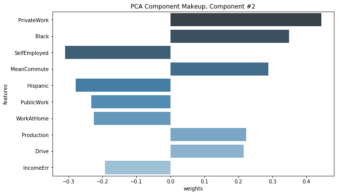


### Step 5 - Deploying the PCA model


This model can now be deployed and used to make "predictions". Instead of seeing what happens with some test data, the training data can instead be passed into the deployed endpoint to create principal components for each data point.


The cell below deploys and hosts this model on a specified instance_type.


```python
%%time
# this takes a little while, around 7mins
pca_predictor = pca_SM.deploy(initial_instance_count=1, 
                              instance_type='ml.t2.medium')
```


    ---------------!CPU times: user 250 ms, sys: 24.1 ms, total: 274 ms
    Wall time: 7min 41s


The original, numpy dataset can be passed to transform the data using the created model. Then the largest n components can be taken to reduce the dimensionality of the data.


```python
# pass np train data to the PCA model
train_pca = pca_predictor.predict(train_data_np)
```


```python
# check out the first item in the produced training features
data_idx = 0
print(train_pca[data_idx])
```


    label {
      key: "projection"
      value {
        float32_tensor {
          values: 0.0002009272575378418
          values: 0.0002455431967973709
          values: -0.0005782842636108398
          values: -0.0007815659046173096
          values: -0.00041911262087523937
          values: -0.0005133943632245064
          values: -0.0011316537857055664
          values: 0.0017268601804971695
          values: -0.005361668765544891
          values: -0.009066537022590637
          values: -0.008141040802001953
          values: -0.004735097289085388
          values: -0.00716288760304451
          values: 0.0003725700080394745
          values: -0.01208949089050293
          values: 0.02134685218334198
          values: 0.0009293854236602783
          values: 0.002417147159576416
          values: -0.0034637749195098877
          values: 0.01794189214706421
          values: -0.01639425754547119
          values: 0.06260128319263458
          values: 0.06637358665466309
          values: 0.002479255199432373
          values: 0.10011336207389832
          values: -0.1136140376329422
          values: 0.02589476853609085
          values: 0.04045158624649048
          values: -0.01082391943782568
          values: 0.1204797774553299
          values: -0.0883558839559555
          values: 0.16052711009979248
          values: -0.06027412414550781
        }
      }
    }


For each of the data points, the top n component values will be retrieved from the list of component data points, returned by the predictor above, and put into a new DataFrame. That DataFrame should look similar to the following:


```
                     c_1         c_2           c_3           c_4          c_5       ...
Alabama-Autauga    -0.060274    0.160527    -0.088356     0.120480    -0.010824    ...
Alabama-Baldwin    -0.149684    0.185969    -0.145743    -0.023092    -0.068677    ...
Alabama-Barbour    0.506202     0.296662     0.146258     0.297829    0.093111    ...
...
```


```python
# create dimensionality-reduced data
def create_transformed_df(train_pca, counties_scaled, n_top_components):
    ''' Return a dataframe of data points with component features. 
        The dataframe should be indexed by State-County and contain component values.
        :param train_pca: A list of pca training data, returned by a PCA model.
        :param counties_scaled: A dataframe of normalized, original features.
        :param n_top_components: An integer, the number of top components to use.
        :return: A dataframe, indexed by State-County, with n_top_component values as columns.        
     '''
    # create a dataframe of component features, indexed by State-County
    # with columns = component values
    counties_transformed = pd.DataFrame()
    
    # for each of the new, transformed data points
    # append the component values to the dataframe
    for data in train_pca:
        # get component values for each data point
        components = data.label['projection'].float32_tensor.values
        counties_transformed = counties_transformed.append([list(components)])
    
    # index by county, just like counties_scaled
    counties_transformed.index = counties_scaled.index
    
    # keep only the top n components
    start_idx = N_COMPONENTS - n_top_components
    counties_transformed = counties_transformed.iloc[:,start_idx:]
    
    # reverse columns, component order
    return counties_transformed.iloc[:,::-1]
```


Now a dataset will be created where each county is described by the top n principle components that were analyzed earlier. Each of these components is a linear combination of the original feature space and can be interpreted by analyzing the makeup of the component, shown previously.


The following code returns the `top_n` components, indexed by 'State-County'.


```python
## Specify top n
top_n = 7

# call your function and create a new dataframe
counties_transformed = create_transformed_df(train_pca, counties_scaled, n_top_components=top_n)

# columns for PCA
PCA_list = ['col_1', 'col_2', 'col_3', 'col_4', 'col_5', 'col_6', 'col_7']
counties_transformed.columns = PCA_list

# print result
counties_transformed.head()
```


Now that the new, transformed training data has been created, the PCA endpoint is no longer needed and can be deleted.


As a clean up step, it is always good to delete endpoints after they have been used (if there is no plan to deploy them to a website, for example).


```python
# delete predictor endpoint
session.delete_endpoint(pca_predictor.endpoint)
```


### Step 6 - Population segmentation 


Now, [K-means Clustering](https://en.wikipedia.org/wiki/K-means_clustering), an unsupervised clustering algorithm, will be used to segment counties using their PCA attributes, which are in the transformed DataFrame that was just created. K-means identifies clusters of similar data points based on their component makeup. Since there were roughly 3000 counties and 34 attributes in the original dataset, the large feature space may have made it difficult to cluster the counties effectively. Instead, the feature space has been reduced to 7 PCA components, and clustering will be done on this transformed dataset.


First a k-means model will be instantiated. A `KMeans` estimator requires a number of parameters to be instantiated, including the type of training instance to use and the model hyperparameters. The [`KMeans` documentation](https://sagemaker.readthedocs.io/en/stable/kmeans.html) details the required parameters, not all of the possible parameters are required.


For k-means, a `k` must be chosen to begin the clustering process. One method for choosing a "good" k, is to choose based on empirical data. A "bad" k would be one so *high* that only one or two very close data points are near it, and another "bad" k would be one so *low* that data points are really far away from the centers.


A k should be selected such that the data points in a single cluster are close together but there are enough clusters to effectively separate the data. This separation can be approximated by measuring how close the data points are to each cluster center, or the average distance between cluster points and the centroid. After trying several values for k, the centroid distance typically reaches some "elbow" - it stops decreasing at a sharp rate and this indicates a good value of k. The graph below indicates the average centroid distance for value of k between 5 and 12.


A distance elbow can be seen around 8 when the distance starts to increase and then decrease at a slower rate. This indicates that there is enough separation to distinguish the data points in each cluster, but also that enough clusters were included so that the data points aren’t *extremely* far away from each cluster.


```python
# define a KMeans estimator
from sagemaker import KMeans

NUM_CLUSTERS = 8

kmeans = KMeans(role=role,
                  train_instance_count=1,
                train_instance_type='ml.c4.xlarge',
                output_path=output_path, # using the same output path defined earlier
                k=NUM_CLUSTERS)
```


In order to create formatted k-means training data, the `counties_transformed` DataFrame should be converted into a numpy array and then into a RecordSet. This is the required format for passing training data into a `KMeans` SageMaker model.


```python
# convert the transformed dataframe into record_set data
kmeans_train_data_np = counties_transformed.values.astype('float32')
kmeans_formatted_data = kmeans.record_set(kmeans_train_data_np)
```


Next, the formatted training data will be fitted and used to train the k-means model.


```python
%%time
# train kmeans
kmeans.fit(kmeans_formatted_data)
```


The trained model can now be deployed to create a `kmeans_predictor`.


```python
%%time
# deploy the model to create a predictor
kmeans_predictor = kmeans.deploy(initial_instance_count=1,
                                 instance_type='ml.t2.medium')
```

    -------------------!CPU times: user 326 ms, sys: 9.13 ms, total: 335 ms
    Wall time: 9min 33s


The training data can be passed in and assigned predicted cluster labels. After deploying the model, the k-means training data can be passed in as a numpy array to get the resultant, predicted cluster labels for each data point.


```python
# get the predicted clusters for all the kmeans training data
cluster_info = kmeans_predictor.predict(kmeans_train_data_np)
```


#### Part A - Exploring the resultant clusters


The resulting predictions should provide information about the cluster that each data point belongs to.


```python
# print cluster info for first data point
data_idx = 0

print('County is: ', counties_transformed.index[data_idx])
print()
print(cluster_info[data_idx])
```

    County is:  Alabama-Autauga
    
    label {
      key: "closest_cluster"
      value {
        float32_tensor {
          values: 2.0
        }
      }
    }
    label {
      key: "distance_to_cluster"
      value {
        float32_tensor {
          values: 0.25205814838409424
        }
      }
    }


#### Part B - Visualizing data distribution across clusters


Now, the cluster labels for each of the county data points will be used to visualize the distribution of points over each cluster.


```python
# get all cluster labels
cluster_labels = [c.label['closest_cluster'].float32_tensor.values[0] for c in cluster_info]
```


```python
# count up the points in each cluster
cluster_df = pd.DataFrame(cluster_labels)[0].value_counts()

print(cluster_df)
```

    6.0    865
    1.0    670
    5.0    402
    2.0    380
    0.0    345
    4.0    248
    7.0    195
    3.0    113
    Name: 0, dtype: int64


```python
# another method of visualizing the distribution
# display a histogram of cluster counts
ax = plt.subplots(figsize=(6,3))
ax = plt.hist(cluster_labels, bins=8, range=(-0.5, 7.5), color='blue', rwidth=0.5)

title = 'Histogram of Cluster Counts'
plt.title(title, fontsize=12)
plt.show()
```


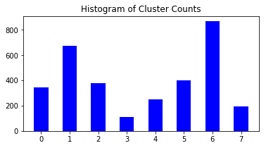


It may be worth asking what each of these clusters reveal about these data points. To improve explainability, the underlying model needs to be accessed to get the cluster centers. These centers will help describe which features characterize each cluster.


Now that the k-means model has been deployed and the cluster labels for each data point have been extracted, the k-means endpoint is no longer needed and can be deleted.


```python
# delete kmeans endpoint
session.delete_endpoint(kmeans_predictor.endpoint)
```


### Step 7 - Model attributes and explainability


Explaining the result of the modeling is an important step in making use of the analysis. By combining PCA, k-means, and the information contained in the model attributes within the SageMaker trained model, one can learn about the population and remark on some of the patterns found within the data.


The k-means model attributes can be extracted from where they are saved as a TAR file in an S3 bucket.


The model will need to be accessed by the k-means training job name, and then unzipped the file into `model_algo-1`. Then, that file can be loaded using MXNet, as before.


```python
# download and unzip the kmeans model file
kmeans_job_name = 'kmeans-2020-04-30-00-14-17-609'

model_key = os.path.join(prefix, kmeans_job_name, 'output/model.tar.gz')

# download the model file
boto3.resource('s3').Bucket(bucket_name).download_file(model_key, 'model.tar.gz')
os.system('tar -zxvf model.tar.gz')
os.system('unzip model_algo-1')
```


    2304


```python
# get the trained kmeans params using mxnet
kmeans_model_params = mx.ndarray.load('model_algo-1')

print(kmeans_model_params)
```


    [
    [[-0.183111    0.02292727 -0.3656865   0.05358226 -0.0096213   0.09657941
      -0.00816908]
     [-0.05329616  0.10942115  0.15640251 -0.0874601  -0.02518595  0.09082595
      -0.02816764]
     [ 0.16866004  0.14511012 -0.0271908   0.12700383  0.05394746 -0.01109949
       0.01014043]
     [ 1.0915015  -0.27826008 -0.15807082 -0.30545545 -0.09566225  0.06041669
       0.04416783]
     [ 0.28224212 -0.31100968 -0.03012372 -0.07224736  0.12371024 -0.12400053
      -0.09205315]
     [-0.22618008 -0.32519668  0.08359768  0.07211731  0.03549498 -0.00305041
       0.06427409]
     [-0.20400493  0.04924424  0.00243984 -0.06359297 -0.05189743 -0.06103007
      -0.01037183]
     [ 0.4994653   0.27069256  0.10037621  0.35823458  0.10273594 -0.07973097
       0.05241996]]
    <NDArray 8x7 @cpu(0)>]


There is only 1 set of model parameters contained within the k-means model: the cluster centroid locations in PCA-transformed, component space.


* **centroids** - the location of the centers of each cluster in component space, identified by the k-means algorithm


```python
# get all the centroids
cluster_centroids=pd.DataFrame(kmeans_model_params[0].asnumpy())
cluster_centroids.columns=counties_transformed.columns

display(cluster_centroids)
```


#### Part A - Visualizing centroids in component space


7-dimensional centroids cannot be visualized in space as humans know and understand it, but a heatmap of the centroids and their location in the transformed feature space can be plotted.


This provides insight into what characteristics define each cluster. Often with unsupervised learning, results are hard to interpret. This is one way to make use of the results of PCA + clustering techniques, together. Since the makeup of each PCA component was able to be examined, it can be understood what each centroid represents in terms of the PCA components.


```python
# generate a heatmap in component space, using the seaborn library
plt.figure(figsize = (12,9))
ax = sns.heatmap(cluster_centroids.T, cmap = 'YlGnBu')
ax.set_xlabel("Cluster")
plt.yticks(fontsize = 16)
plt.xticks(fontsize = 16)
ax.set_title("Attribute Value by Centroid")
plt.show()
```


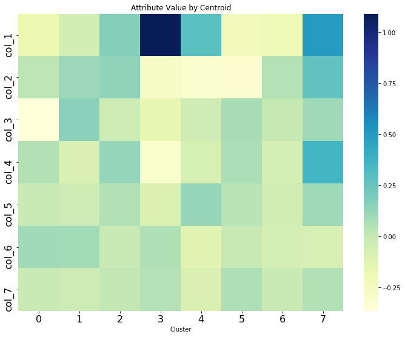


The previously defined `display_component` function can be used to see the corresponding feature-level makeup of each component.


```python
# what do each of these components mean again?
# let's use the display function, from above
component_num=2
display_component(v, counties_scaled.columns.values, component_num=component_num)
```


#### Part B - Natural Groupings


The cluster labels can also be mapped back to each individual county and examined to see which counties are naturally grouped together.


```python
# add a 'labels' column to the dataframe
counties_transformed['labels']=list(map(int, cluster_labels))

# sort by cluster label 0-6
sorted_counties = counties_transformed.sort_values('labels', ascending=True)
# view some pts in cluster 0
sorted_counties.head(20)
```


## Important - Deleting the endpoint


Always remember to shut down the model endpoint if it is no longer being used. AWS charges for the duration that an endpoint is left running, so if it is left on then there could be an unexpectedly large AWS bill.


```python
predictor.delete_endpoint()
```
